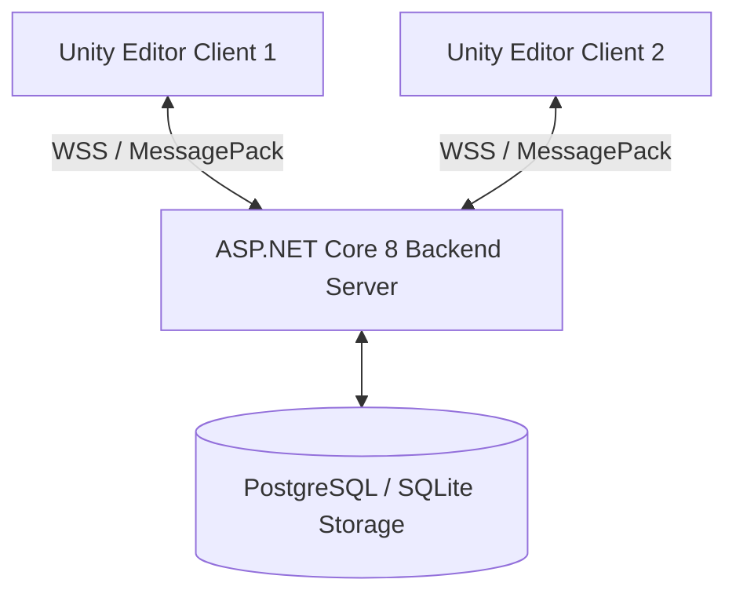

# [screen working] Architecture Overview

## Overview
**[screen working]** (`com.screenworking.collaboration`) is a real-time multi-developer Unity Editor collaboration tool built on a clean-room C# architecture, safe polymorphic serialization, and a Lamport timestamp-based Conflict-Free Replicated Data Type (CRDT) engine.

## System Components
1. **ScreenWorkingIdentity**: Sidecar component guaranteeing persistent GUID assignment across scene save/reload, domain reloads, and duplication.
2. **ScreenWorkingChangeTracker**: Subscribes to Unity change streams (`ObjectChangeEvents`, `EditorSceneManager`) and converts modifications into `CollaborationOperation` payloads.
3. **ScreenWorkingSyncScope**: Thread-static context manager suppressing change capture when applying incoming remote edits to prevent loopback echo loops.
4. **LamportCRDTEngine**: Ensures deterministic scene state convergence using `(LamportTimestamp, ActorId, ActorSequence)` metrics, tombstone deletion tracking, and cycle-free reparenting checks.
5. **ASP.NET Core Server**: Authoritative WebSocket broadcaster, JWT authenticator, and EF Core PostgreSQL/SQLite persistence engine.
